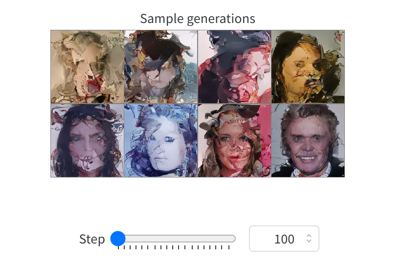
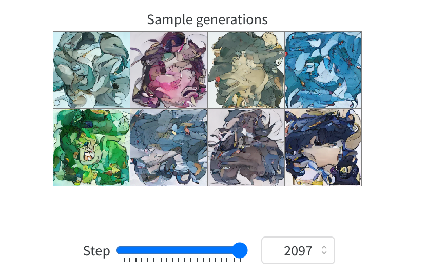
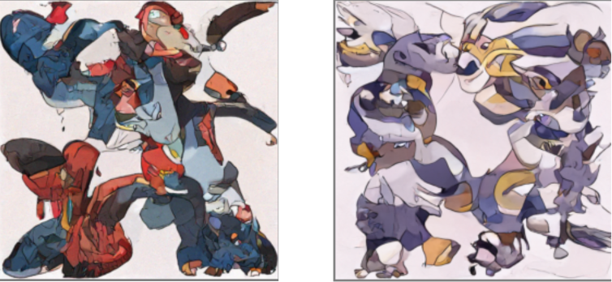

# DiffusionModelForPokemon

This project utilizes the HuggingFace diffusers library to 
generate images. It starts from a pretrained model based
on celebrity faces from `google/ddpm-celebahq-256`
Then, it retrieves a Pokemon image dataset from Kaggle, 
fine-tunes the model with it, and uses DDIM (Diffusion Deformers Inverting Model) 
for faster sampling during inference. Experiment tracking and 
visualization of the fine-tuning process are done using 
weight Weights & Biases. Finally, a demo is produced using Gradio for
UI interaction.

## Installation

```bash
conda create --name diffusion python=3.8.16
conda activate diffusion
pip install torch==1.9.1 torchvision==0.10.1 torchaudio==0.9.0
pip install -qq diffusers datasets accelerate wandb open-clip-torch
pip install -q gradio
```

Make sure to follow Kaggle documentation to set up Kaggle API correctly:

```bash
pip install -q kaggle
mkdir -p ~/.kaggle
cp kaggle.json ~/.kaggle/
chmod 600 ~/.kaggle/kaggle.json
```

Download the Pokemon dataset:

```bash
kaggle datasets download -d hlrhegemony/pokemon-image-dataset
unzip pokemon-image-dataset.zip -d my_pokemon_folder
```

Finally, don't forget to retrieve and use your WandaDB API key in the following script.

```bash
# Initialize wandb for logging
wandb.login(key='YOUR_KEY')
wandb.init(project=wandb_project, config=locals())
```
## Usage

To fine-tune the model, use the following script:

```bash
python pokemen_finetune_diffusion.py
```

## Visualization
The generated images at the beginning (you can still see human faces):

The generated images during the fine-tuning process(human faces get blended with pokemon style):


## Final result
The generated images at the end of the fine-tuning process:


## Demo

To run the Gradio demo, use the following script:

```bash
python gradio_demo.py
```
